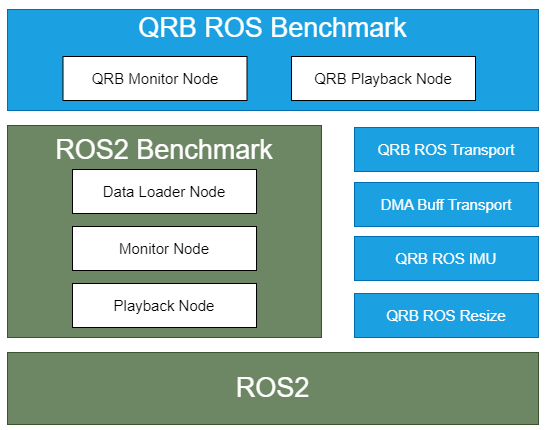

<div align="center">
  <h1>QRB ROS Benchmark</h1>
  <p align="center">
   
  </p>
  <p>ROS2 package for evaluating performance of ROS components on Qualcomm robotics platforms</p>
  <a href="https://ubuntu.com/download/qualcomm-iot" target="_blank"></a>
  <a href="https://docs.ros.org/en/jazzy/" target="_blank"></a>
</div>

---

## 👋 Overview
**QRB ROS Benchmark** is a benchmarking tool designed for evaluating performance of ROS components on Qualcomm robotics platforms. It provides reusable components for benchmarking various message types and ROS nodes, with a focus on zero-copy transport mechanisms.

<div align="center">
  
</div>

<br>

**QRB ROS Benchmark** builds on [ros2_benchmark](https://github.com/NVIDIA-ISAAC-ROS/ros2_benchmark) and extends it with specialized components for benchmarking QRB ROS transport types, including:

- QRB transport types (Image, IMU, PointCloud2)
- DMABuf transport types (Image, PointCloud2)
- Standard ROS message types

---

## 🔎 Table of Contents
  * [APIs](#-apis)
  * [Supported Targets](#-supported-targets)
  * [Installation](#-installation)
  * [Usage](#-usage)
  * [Build from Source](#-build-from-source)
  * [Contributing](#-contributing)
  * [License](#-license)

---

## ⚓ APIs
The basic usage is same to [ros2_benchmark](https://github.com/NVIDIA-ISAAC-ROS/ros2_benchmark) and following are the exclusive message tyeps supported by QRB ROS Benchmark:

**QRB Transport Types:**
- `qrb_ros/transport/type/Image`
- `qrb_ros/transport/type/Imu`
- `qrb_ros/transport/type/PointCloud2`
- `qrb_ros_tensor_list_msgs::msg::TensorList`

**DMABuf Transport Types:**
- `dmabuf_transport/type/Image`
- `dmabuf_transport/type/PointCloud2`

---

## 🎯 Supported Targets

<table >
  <tr>
    <th>Development Hardware</th>
    <th>Hardware Overview</th>
  </tr>
  <tr>
    <td>Qualcomm Dragonwing™ RB3 Gen2</td>
    <th><a href="https://www.qualcomm.com/developer/hardware/rb3-gen-2-development-kit"></a></th>
  </tr>
    <tr>
    <td>Qualcomm Dragonwing™ IQ-9075 EVK</td>
    <th><a href="https://www.qualcomm.com/products/internet-of-things/industrial-processors/iq9-series/iq-9075"></a></th>
  </tr>
</table>

---

## ✨ Installation

> [!IMPORTANT]
> **PREREQUISITES**: The following steps need to be run on **Qualcomm Ubuntu** and **ROS Jazzy**.<br>
> Reference [Install Ubuntu on Qualcomm IoT Platforms](https://ubuntu.com/download/qualcomm-iot) and [Install ROS Jazzy](https://docs.ros.org/en/jazzy/index.html) to setup environment. <br>
> For Qualcomm Linux, please check out the [Qualcomm Intelligent Robotics Product SDK](https://docs.qualcomm.com/bundle/publicresource/topics/80-70018-265/introduction_1.html?vproduct=1601111740013072&version=1.4&facet=Qualcomm%20Intelligent%20Robotics%20Product%20(QIRP)%20SDK) documents.

Add Qualcomm IOT PPA for Ubuntu:

```bash
sudo add-apt-repository ppa:ubuntu-qcom-iot/qcom-noble-ppa
sudo add-apt-repository ppa:ubuntu-qcom-iot/qirp
sudo apt update
```

Install Debian package:

```bash
sudo apt install ros-jazzy-qrb-ros-benchmark
```

## 🚀 Usage

Install the qrb-ros-transport-image-type message:
```bash
sudo add-apt-repository ppa:ubuntu-qcom-iot/qcom-noble-ppa
sudo add-apt-repository ppa:ubuntu-qcom-iot/qirp
sudo apt update
sudo apt install ros-jazzy-qrb-ros-transport-image-type
```

Here comes the minimum template for evaluating [qrb_ros/transport/type/Image](https://github.com/qualcomm-qrb-ros/qrb_ros_transport/tree/main/qrb_ros_transport_image_type):

```bash
vim qrb-ros-transport-image-type_launch.py
```

Write code below into qrb-ros-transport-image-type_launch.py
```python
from launch_ros.actions import ComposableNodeContainer
from launch_ros.descriptions import ComposableNode
from ros2_benchmark import ImageResolution
from ros2_benchmark import ROS2BenchmarkConfig, ROS2BenchmarkTest

def launch_setup(container_prefix, container_sigterm_timeout):
    data_loader_node = ComposableNode(
        name='DataLoaderNode',
        namespace=TestQrbNode.generate_namespace(),
        package='ros2_benchmark',
        plugin='ros2_benchmark::DataLoaderNode',
    )

    # QrbPlaybackNode
    playback_node = ComposableNode(
        name='QrbPlaybackNode',
        namespace=TestQrbNode.generate_namespace(),
        package='qrb_ros_benchmark',
        plugin='qrb_ros::benchmark::QrbPlaybackNode',
        parameters=[{
            'data_formats': [
                'qrb_ros/transport/type/Image'
            ],
        }],
        remappings=[
            ('buffer/input0', '/data_loader_image'),
            ('input0', '/playback_image')
        ]
    )

    # Insert QRB ROS nodes

    # QrbMonitorNode
    monitor_node = ComposableNode(
        name='QrbMonitorNode',
        namespace=TestQrbNode.generate_namespace(),
        package='qrb_ros_benchmark',
        plugin='qrb_ros::benchmark::QrbMonitorNode',
        parameters=[{
            'monitor_data_format': 'qrb_ros/transport/type/Image',
        }]
    )

    composable_node_container = ComposableNodeContainer(
        name='container',
        namespace=TestQrbNode.generate_namespace(),
        package='rclcpp_components',
        executable='component_container_mt',
        prefix=container_prefix,
        sigterm_timeout=container_sigterm_timeout,
        composable_node_descriptions=[
            data_loader_node,
            playback_node,
            monitor_node,
            # Insert QRB ROS nodes
        ],
        output='screen'
    )

    return [composable_node_container]

def generate_test_description():
    return TestQrbNode.generate_test_description_with_nsys(launch_setup)

class TestQrbNode(ROS2BenchmarkTest):
    config = ROS2BenchmarkConfig(
        benchmark_name='Qrb_ros_transport image Test Benchmark',
        input_data_path='/path/to/rosbag',
        publisher_upper_frequency=100.0,
        publisher_lower_frequency=10.0,
        playback_message_buffer_size=10
    )

    def test_benchmark(self):
        self.run_benchmark()
```

Start the qrb-ros-transport-image-type benchmark:
```bash
source /opt/ros/jazzy/setup.bash
launch_test qrb-ros-transport-image-type_launch.py
```

For more usage, please see: [ros2_benchmark](https://github.com/NVIDIA-ISAAC-ROS/ros2_benchmark)

## 👨‍💻 Build from Source

Download the source code and build with colcon:

```bash
source /opt/ros/jazzy/setup.bash && \
mkdir -p ~/ros-ws/src && \
cd ~/ros-ws/src && \
git clone https://github.com/qualcomm-qrb-ros/ros2_benchmark.git && \
git clone https://github.com/qualcomm-qrb-ros/qrb_ros_transport.git && \
git clone https://github.com/qualcomm-qrb-ros/lib_mem_dmabuf.git && \
git clone https://github.com/qualcomm-qrb-ros/qrb_ros_imu.git && \
git clone https://github.com/qualcomm-qrb-ros/dmabuf_transport.git && \
git clone https://github.com/qualcomm-qrb-ros/qrb_ros_benchmark.git && \
git clone https://github.com/qualcomm-qrb-ros/qrb_ros_interfaces.git && \
cd ~/ros-ws/ && \
colcon build --packages-up-to qrb_ros_benchmark
```

---

## 🤝 Contributing

We love community contributions! Get started by reading our [CONTRIBUTING.md](CONTRIBUTING.md).
Feel free to create an issue for bug report, feature requests or any discussion.

---

## 📜 License

Project is licensed under the [BSD-3-Clause](https://spdx.org/licenses/BSD-3-Clause.html) License. See [LICENSE](./LICENSE) for the full license text.
